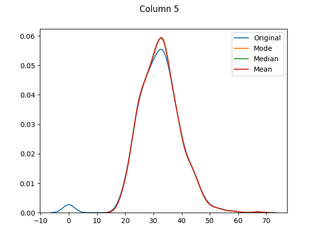
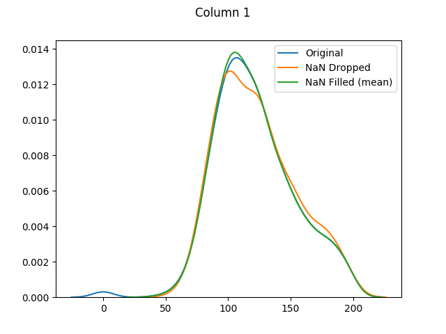
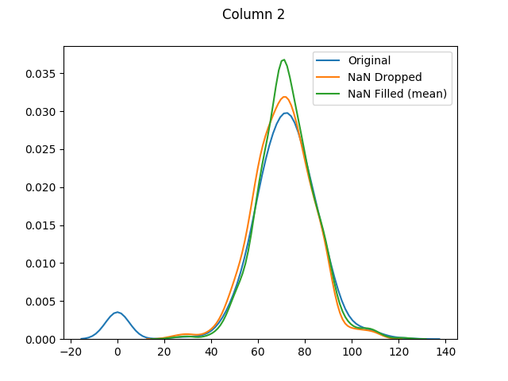
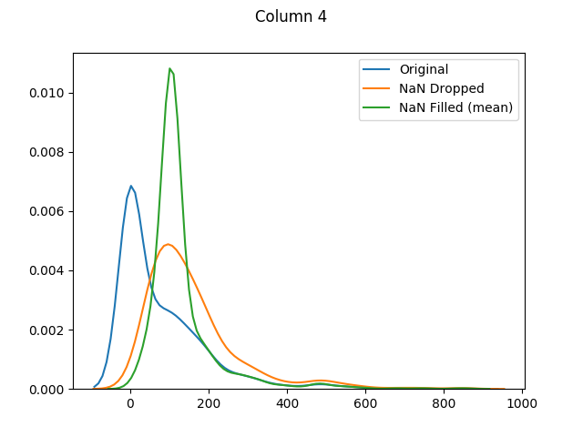
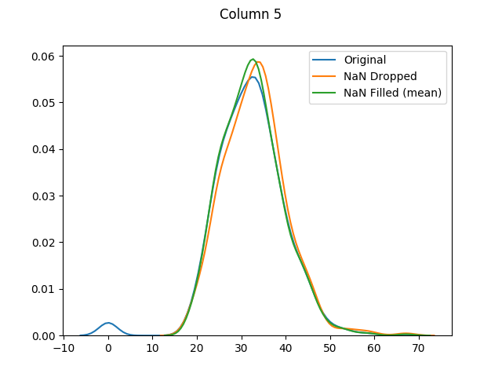

# ML with Missing Data

[](http://snyk.io/test/github/mramshaw/ML_with_Missing_Data?style=plastic&targetFile=requirements.txt)

How to handle missing or incomplete data

## Motivation

One subject that often crops up is how to handle missing or incomplete data.

I decided to try this tutorial to get some background on the issue. The
general approach will be as follows:

1. Describe the data
2. Check for missing values
3. Fill in any missing values
4. Compare the filled-in values with the original values

Following on from my [ML with SciPy](http://github.com/mramshaw/ML_with_SciPy)
exercise, I make sure to carefully examine the structure of the data first!

## Table of Contents

The table of contents is as follows:

* [Missing Data](#missing-data)
* [Data](#data)
* [Summarize the dataset](#summarize-the-dataset)
* [Reference](#reference)
    * [cross_val_score](#cross_val_score)
    * [distplot](#distplot)
    * [dropna](#dropna)
    * [fillna](#fillna)
    * [isnull](#isnull)
    * [mean](#mean)
    * [median](#median)
    * [mode](#mode)
    * [replace](#replace)
* [More on processing missing data](#more-on-processing-missing-data)
* [To Do](#to-do)
* [Credits](#credits)

## Missing Data

This is a long-standing issue. If a sensitive or troublesome field is left as
optional, it will tend to be either: left blank, or else populated with values
such as __N/A__ (meaning possibly "Not Applicable" or "Not Available"). So, using
SICs (Sales Industry Codes - which are generally three digits) as an example,
if this field is made mandatory - and validated for being numeric - the easy data
entry options will tend to be either "000" or "999" (although other options for
"unknown" Sales Industry Codes are of course possible). But none of these values
make for good data analysis.

[The essential problem is that data entry personnel generally lack both
 the training and the data to correctly determine the missing fields.
 Plus they are generally paid by volume, so it is not really in their
 best interests to spend a lot of time on their data-entry problems.]

## Data

We will use the [Pima Indians Diabetes dataset](http://archive.ics.uci.edu/ml/datasets/Pima+Indians+Diabetes).

As it no longer seems to be available, we will use the tutorial author's
[version](http://raw.githubusercontent.com/jbrownlee/Datasets/master/pima-indians-diabetes.data.csv).

This data is known to have missing values. It consists of:

1. Number of times pregnant
2. Plasma glucose concentration a 2 hours in an oral glucose tolerance test
3. Diastolic blood pressure (mm Hg)
4. Triceps skinfold thickness (mm)
5. 2-Hour serum insulin (mu U/ml)
6. Body mass index (weight in kg/(height in m)^2)
7. Diabetes pedigree function
8. Age (years)
9. Class variable (0 or 1)

## Summarize the dataset

This looks as follows:

```bash
$ python missing_data.py 
Rows, columns = (768, 9)

The first 20 observations
-------------------------
     0    1   2   3    4     5      6   7  8
0    6  148  72  35    0  33.6  0.627  50  1
1    1   85  66  29    0  26.6  0.351  31  0
2    8  183  64   0    0  23.3  0.672  32  1
3    1   89  66  23   94  28.1  0.167  21  0
4    0  137  40  35  168  43.1  2.288  33  1
5    5  116  74   0    0  25.6  0.201  30  0
6    3   78  50  32   88  31.0  0.248  26  1
7   10  115   0   0    0  35.3  0.134  29  0
8    2  197  70  45  543  30.5  0.158  53  1
9    8  125  96   0    0   0.0  0.232  54  1
10   4  110  92   0    0  37.6  0.191  30  0
11  10  168  74   0    0  38.0  0.537  34  1
12  10  139  80   0    0  27.1  1.441  57  0
13   1  189  60  23  846  30.1  0.398  59  1
14   5  166  72  19  175  25.8  0.587  51  1
15   7  100   0   0    0  30.0  0.484  32  1
16   0  118  84  47  230  45.8  0.551  31  1
17   7  107  74   0    0  29.6  0.254  31  1
18   1  103  30  38   83  43.3  0.183  33  0
19   1  115  70  30   96  34.6  0.529  32  1
```

Examining the first 20 observations, we can see zeroes
(but no troublesome "99" or "999" values - perhaps medical
personnel are closer to the data) in a number of columns.
It is only reasonable that there should be zeroes in the
first and last columns. So we will check for zeroes in all
of the other columns:

```bash
Number of zero values
---------------------
1      5
2     35
3    227
4    374
5     11
6      0
7      0
dtype: int64
```

It looks like the only problems areas are columns 1,
2, 3, 4 and 5.

According to the tutorial, it is standard practice in Python (specifically Pandas,
NumPy and Scikit-Learn) to mark missing values as NaN.

Firstly, check for missing values using the Pandas [isnull](#isnull) function before
doing any data munging:

```bash
Number of missing fields (original)
-----------------------------------
0    0
1    0
2    0
3    0
4    0
5    0
6    0
7    0
8    0
dtype: int64

Statistics (original)
---------------------
                0           1           2           3           4           5  \
count  768.000000  768.000000  768.000000  768.000000  768.000000  768.000000   
mean     3.845052  120.894531   69.105469   20.536458   79.799479   31.992578   
std      3.369578   31.972618   19.355807   15.952218  115.244002    7.884160   
min      0.000000    0.000000    0.000000    0.000000    0.000000    0.000000   
25%      1.000000   99.000000   62.000000    0.000000    0.000000   27.300000   
50%      3.000000  117.000000   72.000000   23.000000   30.500000   32.000000   
75%      6.000000  140.250000   80.000000   32.000000  127.250000   36.600000   
max     17.000000  199.000000  122.000000   99.000000  846.000000   67.100000   

                6           7           8  
count  768.000000  768.000000  768.000000  
mean     0.471876   33.240885    0.348958  
std      0.331329   11.760232    0.476951  
min      0.078000   21.000000    0.000000  
25%      0.243750   24.000000    0.000000  
50%      0.372500   29.000000    0.000000  
75%      0.626250   41.000000    1.000000  
max      2.420000   81.000000    1.000000  
```

Now we will use the Pandas [replace](#replace) function to replace our troublesome zero values with __NaN__.

And check again for zero (missing) values:

```bash
Number of missing fields (zero fields flagged as NaN)
-----------------------------------------------------
0      0
1      5
2     35
3    227
4    374
5     11
6      0
7      0
8      0
dtype: int64
```

And columns 1, 2, 3, 4 and 5 have missing values.

Lets get the stats for the columns we will be filling:

```bash
Statistics (pre-fill)
---------------------
                1           2           3           4           5
count  763.000000  733.000000  541.000000  394.000000  757.000000
mean   121.686763   72.405184   29.153420  155.548223   32.457464
std     30.535641   12.382158   10.476982  118.775855    6.924988
min     44.000000   24.000000    7.000000   14.000000   18.200000
25%     99.000000   64.000000   22.000000   76.250000   27.500000
50%    117.000000   72.000000   29.000000  125.000000   32.300000
75%    141.000000   80.000000   36.000000  190.000000   36.600000
max    199.000000  122.000000   99.000000  846.000000   67.100000
```

Note that the counts for our troublesome columns have changed as the
(probably) missing fields are ignored - plus the means and standard
deviations have changed.

Lets fill in the missing values with the average (mean) value for that feature.

And check again for missing values (there shouldn't be any):

```bash
Number of missing fields (post-fill)
------------------------------------
0    0
1    0
2    0
3    0
4    0
5    0
6    0
7    0
8    0
dtype: int64
```

Now lets get the stats for the columns we filled-in:

```bash
Statistics (post-fill)
----------------------
                1           2           3           4           5
count  768.000000  768.000000  768.000000  768.000000  768.000000
mean   121.681605   72.254807   26.606479  118.660163   32.450805
std     30.436016   12.115932    9.631241   93.080358    6.875374
min     44.000000   24.000000    7.000000   14.000000   18.200000
25%     99.750000   64.000000   20.536458   79.799479   27.500000
50%    117.000000   72.000000   23.000000   79.799479   32.000000
75%    140.250000   80.000000   32.000000  127.250000   36.600000
max    199.000000  122.000000   99.000000  846.000000   67.100000
```

The means for columns 3 and 4 are different (in both of these columns
zero was actually the __mode__ - or most common value), but otherwise
it's mainly the distributions that have shifted as the zero values
have been adjusted:




[Column 5 only had 11 missing values. As it is fairly normally-distributed,
 the mode, median and mean distributions seem to be almost identical.]

Note that we cannot use a dataset with NaN values for k-fold cross validation:

```bash
Accuracy (with NaN values)
--------------------------
/home/owner/.local/lib/python2.7/site-packages/sklearn/model_selection/_validation.py:542: FutureWarning: From version 0.22, errors during fit will result in a cross validation score of NaN by default. Use error_score='raise' if you want an exception raised or error_score=np.nan to adopt the behavior from version 0.22.
  FutureWarning)

Input contains NaN, infinity or a value too large for dtype('float64').
```

[Throws a __ValueException__, the value of which is shown.]

Now we will use the Pandas [dropna](#dropna) function to drop any entries that contain __NaN__ values.

```bash
Rows, columns (NaN values dropped) = (392, 9)

Statistics (NaN values dropped)
-------------------------------
                1           2           3           4           5
count  392.000000  392.000000  392.000000  392.000000  392.000000
mean   122.627551   70.663265   29.145408  156.056122   33.086224
std     30.860781   12.496092   10.516424  118.841690    7.027659
min     56.000000   24.000000    7.000000   14.000000   18.200000
25%     99.000000   62.000000   21.000000   76.750000   28.400000
50%    119.000000   70.000000   29.000000  125.500000   33.200000
75%    143.000000   78.000000   37.000000  190.000000   37.100000
max    198.000000  110.000000   63.000000  846.000000   67.100000
```

And almost half of our entries have now been dropped.

Let's compare our __k-fold cross validation__ with dropped and filled values:

```bash
Accuracy (with NaN values dropped)
----------------------------------
0.78582892934

Accuracy (with NaN values filled)
---------------------------------
0.766927083333
```

[These are exactly the same as the tutorial's published values.]

And finally let's use `seaborn` to graph our original values versus dropped values versus filled values:










## Reference

Various useful links (and comments) are listed below.

#### cross_val_score

    https://scikit-learn.org/stable/modules/generated/sklearn.model_selection.cross_val_score.html

Will throw a `ValueError` for missing data:

    ValueError: Input contains NaN, infinity or a value too large for dtype('float64').

#### distplot

    http://seaborn.pydata.org/generated/seaborn.distplot.html

Will throw a `ValueError` for missing data:

    ValueError: array must not contain infs or NaNs

#### dropna

    http://pandas.pydata.org/pandas-docs/stable/generated/pandas.DataFrame.dropna.html

Default behavior is to drop entries where ___Any___ field is NaN.

#### fillna

    http://pandas.pydata.org/pandas-docs/stable/generated/pandas.DataFrame.fillna.html

Fill in NA / NaN values.

#### isnull

    http://pandas.pydata.org/pandas-docs/stable/generated/pandas.isnull.html

Detects missing values - such as `NaN` in numeric arrays, `None` or `NaN` in object arrays, `NaT` in datetimelike.

#### mean

    http://pandas.pydata.org/pandas-docs/stable/generated/pandas.DataFrame.mean.html

Note that the default value for __skipna__ is ___True___, which means invalid data
will be ignored when calculating the column mean.

#### median

    http://pandas.pydata.org/pandas-docs/stable/generated/pandas.DataFrame.median.html

Note that the default value for __skipna__ is ___True___, which means invalid data
will be ignored when calculating the column median.

#### mode

    http://pandas.pydata.org/pandas-docs/stable/generated/pandas.DataFrame.mode.html

Note that multiple values may be returned for the selected axis.
Also that the default value for __numeric\_only__ is ___False___.

#### replace

    http://pandas.pydata.org/pandas-docs/stable/generated/pandas.DataFrame.replace.html

Note that the value to be replaced can also be specified by a regex.
Also that the default value for __inplace__ is ___False___.

## More on processing missing data

missing data with `pandas`:

    http://pandas.pydata.org/pandas-docs/stable/missing_data.html

missing data with `sklearn`:

    http://scikit-learn.org/stable/modules/impute.html#impute

## To Do

- [x] Add a Snyk.io vulnerability scan badge
- [x] Graph before and after (mean, median and mode) values
- [x] Conform code to `pylint`, `pycodestyle` and `pydocstyle` standards
- [ ] Fix annoying `sklearn` __FutureWarning__ warnings
- [ ] Generate a [Monte Carlo](http://en.wikipedia.org/wiki/Monte_Carlo_method) style missing-data dataset
      and evaluate how it performs (in comparison to its non-missing-data original)
- [ ] Finish tutorial

## Credits

I (mainly) followed this excellent tutorial:

    http://machinelearningmastery.com/handle-missing-data-python/
