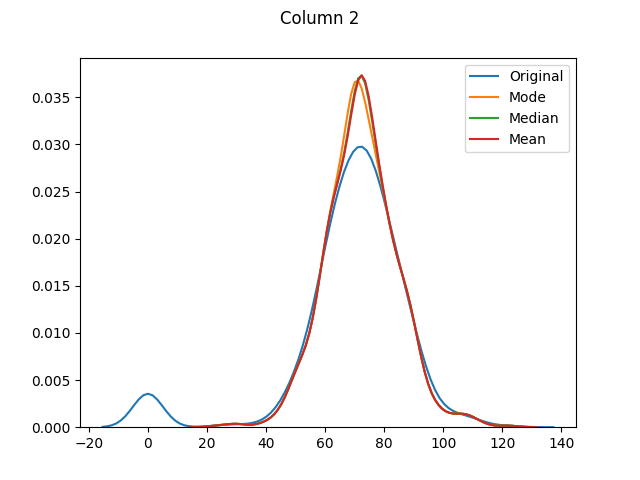
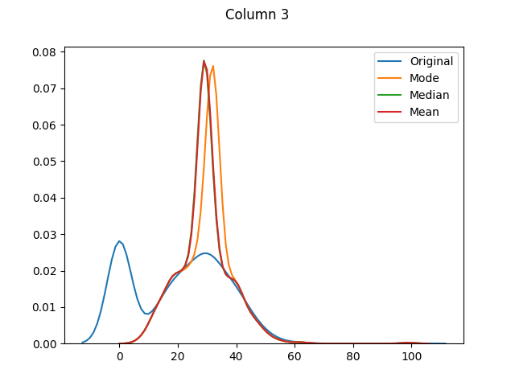
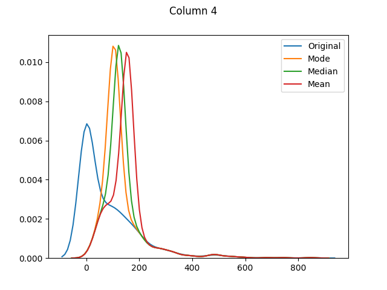

# ML with Missing Data

How to handle missing or incomplete data

## Motivation

One subject that often crops up is how to handle missing or incomplete data.

I decided to try this tutorial to get some background on the issue. We will:

1. Describe the data
2. Check for missing values
3. Fill in any missing values
4. Compare the filled-in values with the original values

Following on from my [ML with SciPy](http://github.com/mramshaw/ML_with_SciPy)
exercise, I make sure to carefully examine the structure of the data first!

## Data

we will use the [Pima Indians Diabetes dataset](http://archive.ics.uci.edu/ml/datasets/Pima+Indians+Diabetes).

However, as it is no longer available, we will use the author's
[version](http://raw.githubusercontent.com/jbrownlee/Datasets/master/pima-indians-diabetes.data.csv).

This data is known to have missing values. It consists of:

1. Number of times pregnant
2. Plasma glucose concentration a 2 hours in an oral glucose tolerance test
3. Diastolic blood pressure (mm Hg)
4. Triceps skinfold thickness (mm)
5. 2-Hour serum insulin (mu U/ml)
6. Body mass index (weight in kg/(height in m)^2)
7. Diabetes pedigree function
8. Age (years)
9. Class variable (0 or 1)

## Summarize the dataset

This looks as follows:

```bash
$ python missing_data.py 
Rows, columns = (768, 9)

The first 20 observations
-------------------------
     0    1   2   3    4     5      6   7  8
0    6  148  72  35    0  33.6  0.627  50  1
1    1   85  66  29    0  26.6  0.351  31  0
2    8  183  64   0    0  23.3  0.672  32  1
3    1   89  66  23   94  28.1  0.167  21  0
4    0  137  40  35  168  43.1  2.288  33  1
5    5  116  74   0    0  25.6  0.201  30  0
6    3   78  50  32   88  31.0  0.248  26  1
7   10  115   0   0    0  35.3  0.134  29  0
8    2  197  70  45  543  30.5  0.158  53  1
9    8  125  96   0    0   0.0  0.232  54  1
10   4  110  92   0    0  37.6  0.191  30  0
11  10  168  74   0    0  38.0  0.537  34  1
12  10  139  80   0    0  27.1  1.441  57  0
13   1  189  60  23  846  30.1  0.398  59  1
14   5  166  72  19  175  25.8  0.587  51  1
15   7  100   0   0    0  30.0  0.484  32  1
16   0  118  84  47  230  45.8  0.551  31  1
17   7  107  74   0    0  29.6  0.254  31  1
18   1  103  30  38   83  43.3  0.183  33  0
19   1  115  70  30   96  34.6  0.529  32  1

...
```

Check for missing values:

```bash
Number of missing fields (original)
-----------------------------------
0    0
1    0
2    0
3    0
4    0
5    0
6    0
7    0
8    0
dtype: int64

Statistics (original)
---------------------
                0           1           2           3           4           5  \
count  768.000000  768.000000  768.000000  768.000000  768.000000  768.000000   
mean     3.845052  120.894531   69.105469   20.536458   79.799479   31.992578   
std      3.369578   31.972618   19.355807   15.952218  115.244002    7.884160   
min      0.000000    0.000000    0.000000    0.000000    0.000000    0.000000   
25%      1.000000   99.000000   62.000000    0.000000    0.000000   27.300000   
50%      3.000000  117.000000   72.000000   23.000000   30.500000   32.000000   
75%      6.000000  140.250000   80.000000   32.000000  127.250000   36.600000   
max     17.000000  199.000000  122.000000   99.000000  846.000000   67.100000   

                6           7           8  
count  768.000000  768.000000  768.000000  
mean     0.471876   33.240885    0.348958  
std      0.331329   11.760232    0.476951  
min      0.078000   21.000000    0.000000  
25%      0.243750   24.000000    0.000000  
50%      0.372500   29.000000    0.000000  
75%      0.626250   41.000000    1.000000  
max      2.420000   81.000000    1.000000  

...
```

Now check for zero (missing) values:

```bash
Number of missing fields (zero fields flagged as NaN)
-----------------------------------------------------
0      0
1      5
2     35
3    227
4    374
5     11
6      0
7      0
8      0
dtype: int64

...
```

It looks like columns 1, 2, 3, 4 and 5 have missing values.

Lets get the stats for the columns we will be filling:

```bash
Statistics (pre-fill)
---------------------
                1           2           3           4           5
count  763.000000  733.000000  541.000000  394.000000  757.000000
mean   121.686763   72.405184   29.153420  155.548223   32.457464
std     30.535641   12.382158   10.476982  118.775855    6.924988
min     44.000000   24.000000    7.000000   14.000000   18.200000
25%     99.000000   64.000000   22.000000   76.250000   27.500000
50%    117.000000   72.000000   29.000000  125.000000   32.300000
75%    141.000000   80.000000   36.000000  190.000000   36.600000
max    199.000000  122.000000   99.000000  846.000000   67.100000

...
```

Lets fill in the missing values with the average (mean) value for that feature.

And check again for missing values (there shouldn't be any):

```bash
Number of missing fields (post-fill)
------------------------------------
0    0
1    0
2    0
3    0
4    0
5    0
6    0
7    0
8    0
dtype: int64

...
```

Now lets get the stats for the columns we filled-in:

```bash
Statistics (post-fill)
----------------------
                1           2           3           4           5
count  768.000000  768.000000  768.000000  768.000000  768.000000
mean   121.681605   72.254807   26.606479  118.660163   32.450805
std     30.436016   12.115932    9.631241   93.080358    6.875374
min     44.000000   24.000000    7.000000   14.000000   18.200000
25%     99.750000   64.000000   20.536458   79.799479   27.500000
50%    117.000000   72.000000   23.000000   79.799479   32.000000
75%    140.250000   80.000000   32.000000  127.250000   36.600000
max    199.000000  122.000000   99.000000  846.000000   67.100000
$
```

Only the distributions have changed:









## Reference

distplot

    http://seaborn.pydata.org/generated/seaborn.distplot.html

fillna

    http://pandas.pydata.org/pandas-docs/stable/generated/pandas.DataFrame.fillna.html

mean

    http://pandas.pydata.org/pandas-docs/stable/generated/pandas.DataFrame.mean.html

[Note that the default value for __skipna__ is ___True___.]

## Credits

I followed this excellent tutorial:

    http://machinelearningmastery.com/handle-missing-data-python/
